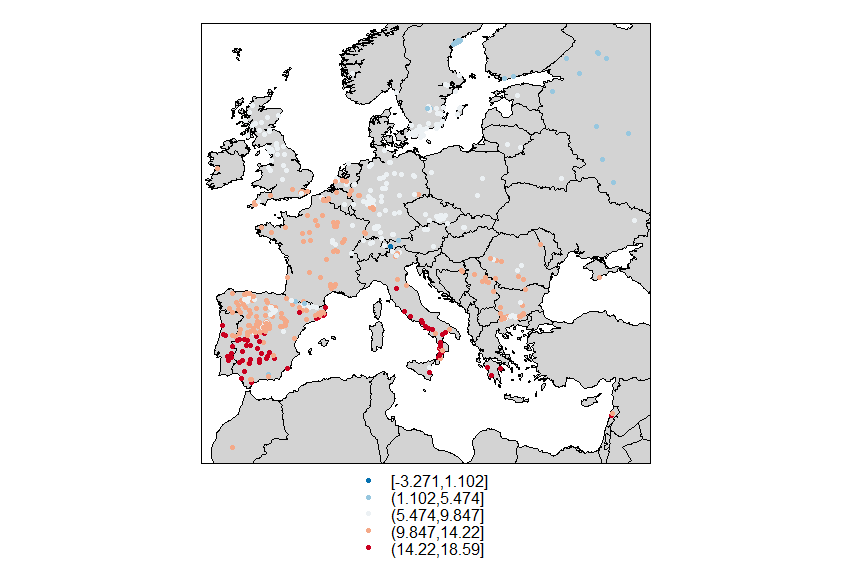
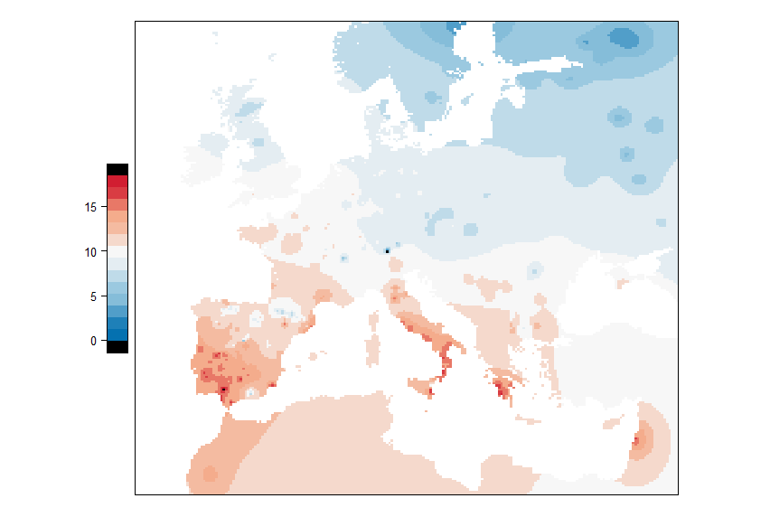

# Spatial_interpolation_and_Visualization
This repo is a simple and fast spatial interpolation tutorial in R.
## Packages
```
library(data.table)
library(dismo)
library(raster)
library(sp)
library(rgdal)
library(gstat)
library(raster)
library(maptools)
library(RColorBrewer)
library(grid)
library(lattice)
```
## Data formate
### [Point data](data\Climatr_bio.csv) with longtitude and latitude
```
 id      long     lat     bio_1
1  88  0.683333 47.4000 11.720834
2 108 -4.066670 48.5167 11.100000
3 139 -4.066670 48.5167 11.100000
4 159  3.933330 47.3500  9.420834
5 265 -1.166670 44.6500 12.995833
6 350  4.116670 46.6667 10.720833
```
### [SHP formate map data](data\World_Countries.shp) for R packages

## Pipeline
### load data and convert to `sp` formate
`CRS` is a important parameter to make sure the same reference system of climate and world data.
```R
climate=read.csv(file.choose(),header=T)
names(climate)[1:3]=c("id","long","lat")
#set the range of longitude and latitude
climate=climate[climate$long<40&climate$long>-15,]
climate=climate[climate$lat<63&climate$lat>30,]
climate=na.omit(climate)
#covert dataframe to sp form
dsp <- SpatialPoints(climate[,c(2,3)], proj4string=CRS("+proj=longlat +datum=WGS84 +no_defs +ellps=WGS84 +towgs84=0,0,0"))
climate_sp <- SpatialPointsDataFrame(dsp,climate)
climate_sp=spTransform(climate_sp, CRS=CRS("+proj=longlat +datum=WGS84 +no_defs +ellps=WGS84 +towgs84=0,0,0"))
#load SHP world map and convert to sp form
worldMap=readOGR(file.choose())
worldSP=spTransform(worldMap, CRS=CRS("+proj=longlat +datum=WGS84 +no_defs +ellps=WGS84 +towgs84=0,0,0"))
```
### Visit point data in map
```R
pols <- list("sp.polygons",worldSP, fill = "lightgray")
colors=rev(colorRampPalette(brewer.pal(5,"RdBu"))(20))
spplot(climate_sp,"bio_1", col.regions=colors, sp.layout=pols, pch=20, cex=1)
```

### Do interpolation
Firstly, convert point data to Voronor geometry and merge geometry to world map.
```R
v <- voronoi(climate_sp)
v1<-intersect(v,worldSP)#
```
Secondly, set raster number of word map.
```R
blank_raster<-raster(nrow=500,ncol=500,extent(worldSP))
values(blank_raster)<-1
bound_raster<-rasterize(worldSP,blank_raster)
bound_raster[!(is.na(bound_raster))] <- 1
```
Finally, project V raster to 500*500 world map raster and do "inverse distance weighting" interpolation.
```R
#project V1 raster to 500*500 raster
vr <- rasterize(v1,bound_raster,i)
#do interpolation
gs <- gstat(formula=as.formula(paste0("climate_sp$",i,"~1")), locations=climate_sp)
idw <- interpolate(bound_raster, gs)
idwmask<-mask(idw,vr)
colors=rev(c(colorRampPalette(brewer.pal(5,"RdBu"))(23)))
spplot(idwmask,col.regions=colors, colorkey = list(space = "left", height = 0.4))
```


 